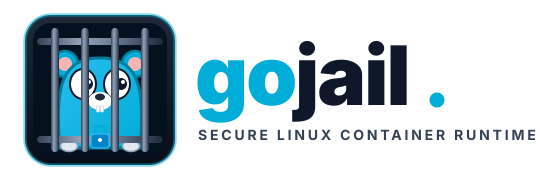

<p align="center">
  
</p>

---

<p align="center">
  <strong>A lightweight, low-level Linux container runtime and process isolation sandbox in Go.</strong>
</p>

`gojail` is a lightweight, low-level Linux container runtime and process isolation sandbox implemented in Go. Built directly on native Linux kernel primitives, it provides strict multi-tenant process isolation, real-time resource throttling, dynamic storage quotas, and client-daemon IPC via Unix domain sockets.

<p align="center">
  <a href="https://github.com/arkrix/gojail/actions"></a>
  <a href="https://pkg.go.dev/github.com/arkrix/gojail"></a>
  <a href="https://goreportcard.com/report/github.com/arkrix/gojail"></a>
  <a href="LICENSE"></a>
</p>

---

## Architecture Overview

```text
                  +-----------------------------+
                  |         gojail CLI          |
                  | (cmd/gojail - Client Layer) |
                  +--------------+--------------+
                                 |
                     Unix Domain Socket IPC
                                 |
                  +--------------v--------------+
                  |           gojaild           |
                  |   (cmd/gojaild - Daemon)    |
                  +--------------+--------------+
                                 |
           +---------------------+---------------------+
           |                     |                     |
 +---------v---------+ +---------v---------+ +---------v---------+
 | Warm Worker Pool  | | State & Registry  | | Recovery Engine   |
 | (Preforked Pods)  | | (Running/Paused)  | | (Crash Resilience)|
 +---------+---------+ +-------------------+ +-------------------+
           |
 +---------v---------+
 |  Child Execution  |
 |  (init_child via  |
 |  Linux Namespaces)|
 +---------+---------+
           |
           v
+-------------+-------------+-------------+-------------+
|             |             |             |             |
v             v             v             v             v
Namespaces    Cgroups v2    OverlayFS     Seccomp      Capabilities
(Mount, PID,  (memory.max,  (tmpfs lower, (Custom BPF  (PR_CAPBSET_DROP,
UTS, IPC,     pids.max,     ext4 upper,   denylist,    NO_NEW_PRIVS)
Net)          cpu.stat)     quotas)       syscall block)
```

---

## Core Security & Isolation Primitives

### 1. Linux Namespaces

Each sandbox execution creates a private namespace barrier using `syscall.SysProcAttr`:

- **Mount (`CLONE_NEWNS`)**: Completely unshares the host filesystem mount hierarchy. Mount propagation is set to `MS_SLAVE | MS_REC` to prevent mount events from leaking to the host.
- **PID (`CLONE_NEWPID`)**: The containerized process runs as PID 1 within its own isolated process table.
- **Network (`CLONE_NEWNET`)**: Unshares host networking. The loopback interface (`lo`) is isolated and host sockets are unreachable.
- **UTS (`CLONE_NEWUTS`)**: Allows setting an independent sandbox hostname matching the container ID.
- **IPC (`CLONE_NEWIPC`)**: Prevents System V IPC and POSIX message queue access across tenants.

### 2. Filesystem Confinement (`pivot_root` & OverlayFS)

- **OverlayFS**: Every sandbox receives an ephemeral layered workspace consisting of a read-only base layer and an isolated read-write scratch layer mounted under `/run/gojail/layers/<id>`.
- **Dynamic Storage Quotas**: Storage limits are enforced on the writable upper scratch directory.
- **True Root Transition (`pivot_root`)**: Unlike insecure `chroot`, `gojail` performs `pivot_root` to make the merged OverlayFS root the system root, unmounts the host root via `MNT_DETACH`, and removes the temporary old-root mount anchor.
- **Device Virtualization**: Mounts a virtualized `/dev` containing only `null`, `zero`, `full`, `random`, `urandom`, and `/dev/pts`, with fallbacks for headless CI environments.

### 3. Resource Governance (Cgroups v2)

Native single-hierarchy Cgroups v2 control via `/sys/fs/cgroup/gojail/<id>`:

- **Memory Constraints (`memory.max`)**: Strict memory caps enforced with hard termination under Out-Of-Memory (OOM) conditions.
- **Process Throttling (`pids.max`)**: Mitigates fork bombs by bounding maximum concurrent threads/processes.
- **Execution Freezing (`cgroup.freeze`)**: Atomically suspends and resumes sandbox execution trees (`gojail pause` / `gojail unpause`).
- **Real-time Telemetry (`cpu.stat`, `memory.current`, `memory.peak`)**: Collects instantaneous CPU utilization and peak memory usage.

### 4. Syscall Filtering (Seccomp-BPF) & Privilege Stripping

- **Ambient & Bounding Capabilities**: Clears capabilities across `0..63` via `unix.Prctl(unix.PR_CAPBSET_DROP)` and sets `PR_SET_NO_NEW_PRIVS`.
- **BPF Filter Generation**: Compiles an in-memory BPF instruction array blocking critical system calls (`ptrace`, `bpf`, `mount`, `umount2`, `pivot_root`, `reboot`, `kexec_load`, `syslog`, `keyctl`, `add_key`, `request_key`, `swapon`, `swapoff`, `chroot`).
- **Profile Loading**: Supports custom JSON profiles defining architectures, default actions, and explicit syscall rules.

---

## Daemon & Lifecycle Management

`gojaild` acts as the persistent supervisor:

- **Warm Worker Pool**: Maintains pre-forked, pre-isolated worker containers in a warm queue to reduce container initialization overhead.
- **State Registry**: Tracks container metadata, runtime statistics, and lifecycle transitions.
- **Crash Recovery Engine**: Scans persistent states and recovers or cleans orphaned cgroup trees and OverlayFS mounts after daemon crashes or ungraceful restarts.
- **Streaming Protocol**: Custom binary/JSON wire protocol supporting real-time multiplexed stdout and stderr streams over the Unix domain socket.

---

## Repository Structure

```text
├── cmd/
│   ├── gojail/                # CLI frontend entrypoint
│   └── gojaild/               # Long-running supervisor daemon
├── pkg/
│   ├── client/                # Unix domain socket client library
│   ├── config/                # YAML configuration loader & validation
│   ├── protocol/              # Wire protocol framing and serializers
│   ├── sandbox/               # Core runtime: namespaces, cgroups, overlayfs, runner
│   ├── seccomp/               # BPF compilation and profile parser
│   └── server/                # Daemon server, worker pool, and recovery engine
├── .github/
│   ├── dependabot.yml         # Dependency automation with semver-major protection
│   └── workflows/
│       └── ci.yml             # Lint, govulncheck, root integration, multi-arch builds
├── go.mod
├── go.sum
└── README.md
```

---

## CI/CD Pipeline

The project uses GitHub Actions configured in `.github/workflows/ci.yml`:

- **Linting & Security**: Enforces Go formatting (`gofmt -l .`), static analysis (`go vet`), and official vulnerability scanning (`govulncheck`).
- **Unit Tests**: Runs with race detection (`go test -race ./pkg/...`).
- **Root Integration Tests**: Runs integration suites (`pkg/sandbox`, `pkg/server`) under `sudo` with automatic Cgroup v2 subtree delegation (`+memory +pids +cpu`).
- **Headless Device Handling**: Tests run across headless virtual environments with automatic `/dev/tty` node fallbacks.
- **Cross-Architecture Verification**: Builds standalone binaries for `linux/amd64` and `linux/arm64`.
- **Automated Dependency Updates**: Dependabot batches weekly module updates into grouped, scoped conventional commits (`chore(deps)` and `ci(actions)`).

---

## Getting Started

### Prerequisites

- Linux Kernel $\ge$ 5.8 with Cgroups v2 enabled
- Go $\ge$ 1.22
- Root privileges (required for Linux namespace and cgroup configuration)

### Building from Source

```bash
# Clone the repository
git clone https://github.com/arkrix/gojail.git
cd gojail

# Build the client CLI and daemon binaries
go build -o bin/gojail ./cmd/gojail
go build -o bin/gojaild ./cmd/gojaild
```

### Running Tests

```bash
# Run unit tests
go test -v -race ./pkg/...

# Run root-level integration tests (requires sudo)
sudo -E env "PATH=$PATH" go test -v ./pkg/sandbox/...
sudo -E env "PATH=$PATH" go test -v ./pkg/server/...
```

### Basic Usage

1. **Start the supervisor daemon:**

   ```bash
   sudo ./bin/gojaild
   ```

2. **Execute a command inside an isolated jail:**

   ```bash
   sudo ./bin/gojail run -mem 128 -procs 32 -c "echo 'Hello from isolated jail'"
   ```

3. **Inspect live statistics:**

   ```bash
   sudo ./bin/gojail stats <container_id>
   ```

4. **Freeze and thaw execution:**

   ```bash
   sudo ./bin/gojail pause <container_id>
   sudo ./bin/gojail unpause <container_id>
   ```

## License

This project is licensed under the Apache 2.0 License.